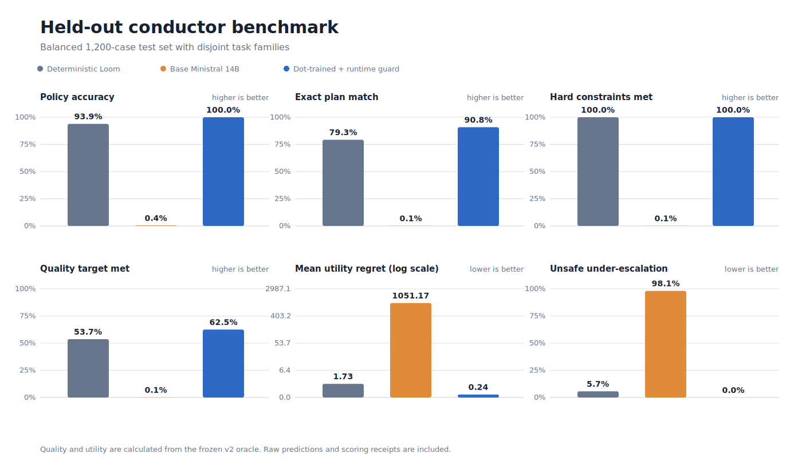
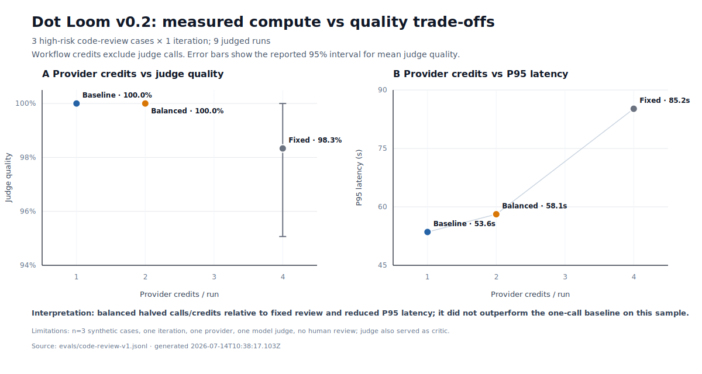
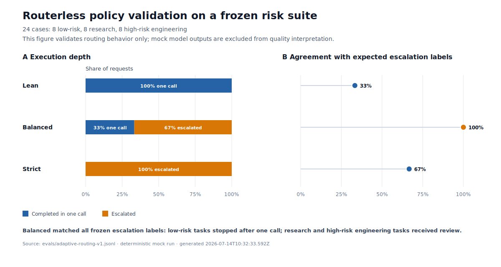

# Dot Loom

[](https://github.com/usedotai/dot-loom/stargazers)

[Changelog](CHANGELOG.md) · [Benchmark methodology](docs/BENCHMARKING.md) · [Conductor research](research/ministral-conductor/) · [Raw benchmark receipts](docs/benchmarks/)

**Set a quality target and a cost ceiling. Spend extra inference only when the task earns it.**

Dot Loom is an open, provider-pluggable adaptive inference runtime. Its default policy answers directly, then selectively buys verification for high-risk work. Every run exposes the chosen policy, call budget, escalation reason, cost, latency, tokens, and receipt.

It is not a foundation model. It decides how much inference an existing request needs:

```txt
low risk      direct answer                         1 call
high risk     direct answer -> verifier/editor      2 calls
strict        draft -> critic -> finalizer           3 calls
fixed         router -> draft -> critic -> finalizer 4 calls
```

Run the same workflow with Dot, OpenRouter, OpenAI-compatible endpoints, Ollama, LM Studio-compatible local servers, or deterministic mocks.

```bash
npm run eval:mock
```

```txt
Strategy          Quality + CI    Avg calls    One-call rate    Escalation    Cost    P95
Baseline          measured        1.00         100%             n/a           measured measured
Loom lean         measured        <=1.00       measured         0%            measured measured
Loom balanced     measured        <=2.00       measured         measured      measured measured
Loom strict       measured        <=3.00       measured         measured      measured measured
Loom fixed        measured        4.00         0%               n/a           measured measured
```

Loom fills that table from actual runs. It leaves unavailable fields blank rather than inventing benchmark wins.

Dot Loom is the open R&D surface behind the same systems philosophy as Dot Supercharged: do not assume one giant model is always the right inference primitive. Route, draft, verify, synthesize, and measure.

## Status

This repository is a testable alpha runtime with reproducible public evaluations and a learned-conductor research track. It is suitable for experiments, demos, provider tests, and architecture review. It is not yet a production replacement for commercial multi-agent systems.

Current maturity: testable alpha.

What works now:

- Fixed orchestration pipeline.
- Routerless `lean`, `balanced`, and `strict` adaptive policies.
- Enforced call, estimated-credit, and wall-clock ceilings.
- Selective verifier-editor escalation with no mandatory finalizer call.
- Provider abstraction for Dot, OpenAI-compatible APIs, Ollama, and mock runs.
- Streaming CLI traces.
- Per-role token and timing summaries.
- Reproducible baseline vs lean vs balanced vs strict vs fixed eval runs.
- Independent, strategy-blinded model judging with task-specific rubrics.
- Parallel eval execution for larger suites.
- Shareable HTML, SVG, Markdown, and JSON benchmark reports.
- A 15-case adversarial backend/code-review suite and 24-case mixed-difficulty routing suite.
- Quality confidence intervals, call selectivity, route accuracy, and budget-limit reporting.
- Studio UI for visualizing model interaction and live process traces.
- BYOK Studio bridge that can run arbitrary role maps without persisting provider keys.
- Provider cancellation signals for adaptive latency ceilings.
- Access-list based prior-output gating in adaptive mode.
- A reproducible Ministral 14B conductor research run with a held-out 1,200-case benchmark, raw predictions, runtime-guard fallback, GPU telemetry, and adapter hashes.

What is not done yet:

- Human-reviewed benchmark results across multiple providers.
- Production integration and continual calibration of the learned conductor; the JavaScript runtime still defaults to its local deterministic policy.
- Parallel branch execution.
- Tool-call isolation per worker.
- Long-term trace corpus and regression dashboard.
- Reproducible benchmark claims against Fugu, MoA, or frontier single-model baselines.

## Repository Layout

```txt
dot-loom/
  src/
    cli.mjs                         CLI entrypoint
    config.mjs                      provider/model config parsing
    fusion.mjs                      fixed pipeline runtime
    adaptive.mjs                    budgeted adaptive policy/runtime
    eval.mjs                        benchmark runner and scoring
    report.mjs                      shareable HTML/SVG reports
    providers/                      provider adapters
    pipelines/                      pipeline profiles
  examples/
    mock.config.json                offline deterministic demo
    dot.config.json                 Dot API example
    dot-code.config.json            Dot API code-review lane
    openrouter.config.json          OpenRouter compatible example
    ollama.config.json              local Ollama example
  evals/
    code-review-v1.jsonl            adversarial public benchmark suite
    adaptive-routing-v1.jsonl       mixed-difficulty routing benchmark
  docs/
    BENCHMARKING.md                 publication methodology
    STUDIES.md                      research evidence and boundaries
  research/ministral-conductor/     learned policy source, corpus, receipts, and results
  studio/
    server.mjs                      local Studio bridge
    src/                            React visualization surface
```

## Installation

Requirements:

- Node.js 20 or newer.
- Optional provider API keys.
- Optional Ollama if running local models.

Install Studio dependencies only if you want the UI:

```bash
cd dot-loom
npm run studio:install
```

The CLI itself has no runtime dependencies.

## CLI Quick Start

Run the deterministic mock pipeline:

```bash
npm run demo
```

Inspect a config:

```bash
npm run doctor
```

List pipeline profiles:

```bash
node src/cli.mjs pipelines
```

Run fixed orchestration:

```bash
node src/cli.mjs run "Review this API design for billing and privacy bugs." \
  --pipeline code-review \
  --config examples/mock.config.json
```

Run adaptive orchestration:

```bash
node src/cli.mjs run "Review this API design for billing and privacy bugs." \
  --adaptive \
  --policy balanced \
  --pipeline code-review \
  --config examples/mock.config.json
```

Choose an explicit computation policy:

```bash
# One provider call maximum.
node src/cli.mjs run "Summarize this note." --adaptive --policy lean --max-calls 1 \
  --config examples/mock.config.json

# One call normally; a second verifier-editor call for risky work.
node src/cli.mjs run "Review this payment API." --adaptive --policy balanced \
  --max-calls 2 --max-credits 2 --max-latency-ms 30000 \
  --config examples/dot.config.json

# Three-call review depth, still without a paid router.
node src/cli.mjs run "Audit this authorization design." --adaptive --policy strict \
  --config examples/mock.config.json
```

`--max-calls`, `--max-credits`, and `--max-latency-ms` are hard pre-step ceilings. `--credit-per-call` supplies a default planning estimate. When models have different provider-unit costs, configure `adaptive.estimatedCreditsByModel` so Loom can reserve the correct amount before each role starts:

```json
{
  "adaptive": {
    "maxCredits": 18,
    "estimatedCreditsPerCall": 1,
    "estimatedCreditsByModel": {
      "dot/openai-gpt-5.5": 14,
      "dot/claude-sonnet-5": 4,
      "dot/dot-qwen-coder-480b": 1
    }
  }
}
```

Native provider receipts remain the source of actual usage after a call. A call count is not a price estimate.

Run baseline only:

```bash
node src/cli.mjs run "Review this API design for billing and privacy bugs." \
  --baseline \
  --config examples/mock.config.json
```

Emit JSON:

```bash
node src/cli.mjs run "Find edge cases in a credits API." \
  --pipeline code-review \
  --config examples/mock.config.json \
  --json
```

## Reproducible Evaluations

Compare the single-model baseline with every Loom computation policy:

```bash
npm run eval:mock
```

Run the public code-review suite and generate a shareable report:

```bash
node src/cli.mjs eval \
  --dataset evals/adaptive-routing-v1.jsonl \
  --config examples/dot-code.config.json \
  --strategies baseline,adaptive-lean,adaptive-balanced,adaptive-strict,fixed \
  --iterations 3 \
  --concurrency 3 \
  --output reports/code-review-v1.html
```

Each dataset line can contain a prompt, deterministic acceptance checks, and an expected escalation label:

```json
{"id":"credits-api","pipeline":"code-review","expectedEscalation":true,"prompt":"Review this credits API.","checks":[{"type":"contains","value":"privacy"},{"type":"contains-any","values":["billing","credit"]},{"type":"not-contains","value":"sorry"}]}
```

Supported checks are `contains`, `contains-any`, and `not-contains`. Without a model judge, quality is the percentage of checks passed and pass rate is the percentage of runs satisfying every check. Reports include 95% confidence intervals, average calls, one-call rate, escalation rate, and route accuracy when labels are present.

For rubric-based evaluation, use an independent judge model:

```bash
node src/cli.mjs eval \
  --dataset evals/code-review-v1.jsonl \
  --config examples/dot-code.config.json \
  --judge-model dot/your-independent-judge \
  --include-answers \
  --output reports/code-review-v1.json
```

The judge receives the task, rubric, and candidate answer, but not the strategy name, models, cost, or latency. Judge usage is recorded separately and excluded from workflow cost. Model judging remains a proxy; publishable studies should include human review.

Cost is calculated from actual token usage only when every invoked model has explicit per-million-token pricing:

```json
{
  "pricing": {
    "provider/model-id": {
      "inputPerMillion": 0.15,
      "outputPerMillion": 0.60
    }
  }
}
```

Pricing is configuration, never a built-in marketing assumption. If any price is missing, Loom reports USD cost as unavailable instead of inventing a number. Every JSON run includes per-model token usage and configured USD cost or native provider-receipt data. When the baseline has a non-zero measured cost, the report also normalizes it to a cost index of `100`.

When a provider returns a native payment receipt, Loom can use that provider unit, such as Dot credits, without pretending it is USD. Judge cost is tracked separately and excluded from workflow cost.

Output format follows the file extension:

```txt
report.html    responsive evidence dashboard
report.svg     shareable benchmark card
report.md      Markdown comparison table
report.json    complete machine-readable receipt
```

Read the [benchmark methodology](docs/BENCHMARKING.md) before publishing performance claims.

## We trained a Mistral model to conduct Loom



We trained `mistralai/Ministral-3-14B-Base-2512` to decide when one model is enough and when a task needs independent verification. It does not answer the user. It emits a constrained execution plan: Lean, Balanced, or Strict; writer, reviewer, and finalizer roles; call, credit, and latency budgets; provider independence; and role-access lists.

Provider names are examples, not dependencies. In the retained live demo:

- A low-risk rewrite routes Lean to one local Ministral call at 0.15 estimated credits.
- A payment-race audit routes Strict: local Ministral writes, Claude reviews, OpenAI finalizes.
- An SSRF audit routes Strict through the same independently verified three-model path.

The conductor remains model and provider agnostic. The same roles can be OpenAI, Claude, DeepSeek, Qwen, a Dot model, Ollama, or any OpenAI-compatible endpoint.

### Held-out result

The test contains 1,200 balanced synthetic routing cases from eight task families absent from training and validation. Every raw output is published.

| Lane | Policy accuracy | Exact role plan | Hard budgets met | Unsafe under-escalation | Mean utility regret |
|---|---:|---:|---:|---:|---:|
| Deterministic Loom | 93.9% | 79.3% | 100.0% | 5.7% | 1.733 |
| Dot-trained raw proposals | 99.7% | 90.2% | 98.9% | 0.0% | 11.823 |
| Dot-trained + runtime guard | 100.0% | 90.8% | 100.0% | 0.0% | 0.245 |

The raw model exceeded a hard budget on 13 of 1,200 proposals. Loom's local guard recomputed the plans, rejected those 13, and used the deterministic fallback. We publish both lanes because a learned router should propose and deterministic code should enforce.

Against deterministic Loom, the guarded conductor delivered:

- +11.5 percentage points exact-plan match, paired bootstrap 95% CI +9.4 to +13.7 points
- +8.8 points quality-target attainment, paired bootstrap 95% CI +7.3 to +10.5 points
- 86% lower mean utility regret
- 0% unsafe under-escalation versus 5.7%
- 1.1% runtime fallback rate

Training used 9,000 synthetic examples and 900 validation examples with no user prompts. Rank-32 BF16 LoRA training took 52.6 minutes on one H200, averaged 96.6% GPU utilization, used 0.588 kWh, and produced a 534.1 MiB adapter. A blinded 90-label OpenAI audit agreed with 84.4% of labels; deterministic validation found that none of its feasible alternatives improved the disclosed oracle utility.

- [Full technical report](research/ministral-conductor/reports/CONDUCTOR-BENCHMARK.md)
- [Methods and limitations](research/ministral-conductor/docs/METHODS.md)
- [Raw predictions, scored outputs, and paired statistics](research/ministral-conductor/reports/)
- [Training, machine, audit, telemetry, and hash receipts](research/ministral-conductor/receipts/)
- [Reproducible source, corpus, tests, and demo commands](research/ministral-conductor/)

This result measures routing-plan generation against a disclosed synthetic oracle calibrated to the frozen six-case cross-model receipt below. It does not claim end-to-end code-quality improvement or a universal model ranking.

## OpenAI vs Claude vs Dot baseline benchmark


On 2026-07-14, we ran OpenAI GPT-5.5, Claude Sonnet 5, and Dot Qwen Coder 480B on the same six frozen high-risk backend-review cases. A separate DeepSeek V4 Pro model judged all 18 answers without seeing model or strategy identity.

| Single-model lane | Judge quality | 95% interval | Full pass rate | Avg provider credits | P95 latency |
|---|---:|---:|---:|---:|---:|
| OpenAI GPT-5.5 | 100.0% | 100.0% to 100.0% | 100.0% | 12.67 | 72.37s |
| Claude Sonnet 5 | 88.3% | 65.5% to 100.0% | 83.3% | 3.50 | 64.73s |
| Dot Qwen Coder 480B | 70.0% | 39.1% to 100.0% | 50.0% | 1.00 | 25.86s |

Provider credits were model dependent. One call was not one credit: the OpenAI baseline averaged 12.67 credits, Claude 3.50, and Dot 1.00. This observation led directly to model-specific budget estimates in Loom's pre-step credit guard.


These are single-model baselines, not proof that cross-model review improves answers. The larger six-lane matrix stopped with HTTP 402 before the reviewer lanes completed. We publish the 18 completed answers and judge reasons, leave the missing comparisons blank, and provide the resumable benchmark command for a funded rerun.

- [Raw baseline receipt with candidate answers and judge reasons](docs/benchmarks/cross-model-baselines-v1.json)
- [Technical baseline report](docs/benchmarks/CROSS_MODEL_BASELINES.md)
- [Baseline summary CSV](docs/figures/cross-model-baselines.csv)
- Run the full six-lane matrix with `npm run benchmark:cross-model`.
- Generate the completed paired-delta figures with `npm run figures:cross-model:complete`.

Limitations: six synthetic cases, one iteration, one model judge, no human review, and all models accessed through the same Dot API gateway. Judge calls used 20 additional credits and are excluded from the workflow-credit column.

## Budgeted adaptive smoke benchmark (`v0.2`)



On 2026-07-14, we reran the same first three high-risk `code-review-v1` cases through the routerless budgeted runtime. Each answer was judged without strategy or model identity. Workflow calls and Dot credit receipts include every generation step; judge calls averaged one additional credit and remain separate.

| Strategy | Judge quality | Avg calls | Provider cost/run | Cost index | P95 latency | Full pass rate |
|---|---:|---:|---:|---:|---:|---:|
| Single-model baseline | 100.0% | 1.00 | 1.00 credit | 100 | 53.56s | 66.7% |
| Loom balanced | 100.0% | 2.00 | 2.00 credits | 200 | 58.11s | 66.7% |
| Loom fixed | 98.3% | 4.00 | 4.00 credits | 400 | 85.19s | 66.7% |

Balanced cut calls and credits by 50% versus fixed review and reduced P95 latency by roughly 32%, while matching the baseline on this sample. It did **not** beat the baseline on quality and still cost twice as much. Because all three cases are high-risk, balanced escalated every case; the 24-case mixed suite exists to measure one-call selectivity across easier work.

This remains an exploratory smoke result: three synthetic cases, one iteration, one provider, one model judge, no human review, and a 900-token per-call output cap. The judge model also served as Loom's critic, creating a possible self-preference dependency despite strategy blinding. Do not generalize the zero observed judge-quality gap beyond these runs.

- [Raw `v0.2` JSON receipt](docs/benchmarks/dot-code-review-smoke-v2.json)
- [Figure data as CSV](docs/figures/v02-smoke-summary.csv)
- [Responsive `v0.2` HTML report](docs/benchmarks/dot-code-review-smoke-v2.html)
- [`v0.2` Markdown report](docs/benchmarks/dot-code-review-smoke-v2.md)
- [24-case structural routing validation](docs/benchmarks/adaptive-routing-mock.md)

### Routerless policy selectivity



The 24-case mixed-difficulty suite checks whether each policy executes at the intended depth. Balanced used one call on 33.3% of cases and escalated the other 66.7%, averaging 1.67 calls with 100% structural route accuracy. Lean always stopped after one call; strict always ran three. Because this suite uses deterministic mock outputs, it validates policy selection and accounting, not model quality.

- [Raw structural-validation JSON](docs/benchmarks/adaptive-routing-mock.json)
- [Figure data as CSV](docs/figures/policy-selectivity.csv)
- Rebuild both research figures from committed receipts with `npm run figures`.

## Historical Dot smoke benchmark (`v0.1`)

On 2026-07-14, we ran the first three `code-review-v1` cases once through the original `v0.1` Dot model map. Gemma judged answers without seeing strategy names or model identities. This receipt is retained as historical evidence and does **not** measure the routerless budgeted adaptive runtime introduced in `v0.2`.

| Strategy | Judge quality | Provider cost/run | Cost index | P95 latency | Full pass rate |
|---|---:|---:|---:|---:|---:|
| Single-model baseline | 96.7% | 1.00 credit | 100 | 22.70s | 66.7% |
| Loom fixed | 100.0% | 4.00 credits | 400 | 88.77s | 100.0% |
| Loom adaptive | 98.3% | 4.00 credits | 400 | 82.25s | 66.7% |

The useful finding is not “more models are cheaper.” On this tiny high-risk sample, fixed orchestration improved rubric/check coverage, but required four provider calls and roughly four times the latency and credits. The old adaptive implementation also made four calls. That negative result directly motivated `v0.2`: no paid router, one call for accepted direct answers, two calls for balanced high-risk review, and explicit ceilings.

This is an **exploratory smoke result**, not a general benchmark claim: three synthetic cases, one iteration, one provider, one model judge, no human review, and a 900-token workflow cap. Judge calls averaged one additional credit and are excluded from the workflow-cost column.

- [Raw JSON receipt](docs/benchmarks/dot-code-review-smoke.json)
- [Shareable HTML report](docs/benchmarks/dot-code-review-smoke.html)
- [Markdown report](docs/benchmarks/dot-code-review-smoke.md)
- [Full 15-case suite](evals/code-review-v1.jsonl)
- [Mixed-difficulty 24-case routing suite](evals/adaptive-routing-v1.jsonl)
- [Publication methodology](docs/BENCHMARKING.md)

## What published studies suggest

These are results reported by the cited authors on different tasks, models, and metrics. They are **not Dot Loom results and are not directly comparable**.

| Study | Author-reported finding | Why it matters to Loom |
|---|---|---|
| [FrugalGPT](https://arxiv.org/abs/2305.05176) | Up to 98% cost reduction while matching the best individual LLM in reported experiments; or +4% accuracy over GPT-4 at the same cost | Cascades can improve a task-specific cost/quality frontier |
| [RouteLLM](https://arxiv.org/abs/2406.18665) | More than 2× cost reduction in some settings without sacrificing response quality | Learned routing can avoid unnecessary strong-model calls |
| [BEST-Route](https://arxiv.org/abs/2506.22716) | Up to 60% reported cost reduction with less than 1% performance drop by routing model and sample count | Loom should route complete computation strategies, not only model names |
| [R2-Router](https://openreview.net/forum?id=S3m1tSp8F4) | Jointly routes model and output-length budget | Output length is part of the inference budget, not a fixed afterthought |
| [CONCUR](https://openreview.net/forum?id=gCUY6QIv8r) | Modular per-strategy predictors support constrained and continual routing | New Loom strategies should be addable without retraining one monolithic router |
| [Mixture-of-Agents](https://arxiv.org/abs/2406.04692) | 65.1 on AlpacaEval 2.0 for the reported open-source MoA configuration vs 57.5 for GPT-4 Omni | Aggregating diverse model outputs can outperform an individual model |
| [Self-Refine](https://arxiv.org/abs/2303.17651) | Roughly 20 percentage points absolute average improvement across seven reported tasks | Feedback and refinement can improve first-pass outputs |

See [Research behind Dot Loom](docs/STUDIES.md) for additional studies, direct links, and interpretation boundaries.

## Studio

Start the local Studio:

```bash
npm run studio
```

Default URL:

```txt
http://localhost:3955
```

The Studio exposes four modes:

- `DEMO`: visual deterministic simulation, no provider call.
- `CLI-MOCK`: real CLI execution with the mock provider.
- `CLI-DOT`: real CLI execution using `DOT_API_KEY`.
- `CLI-BYOK`: real CLI execution using a provider selected in the UI.

The BYOK bridge writes a temporary config to the OS temp directory, executes the CLI, then deletes the config. API keys pasted into the Studio are not written into this repository.

## Provider Model

Model references use this format:

```txt
provider/model-id
```

Minimal provider config:

```json
{
  "providers": {
    "dot": {
      "type": "dot",
      "baseUrl": "https://api.usedot.xyz/agent/v1",
      "apiKey": "env:DOT_API_KEY"
    }
  },
  "models": {
    "router": "dot/dot-nemotron-nano",
    "drafter": "dot/dot-deepseek-v4-flash",
    "critic": "dot/dot-gemma-4-uncensored",
    "finalizer": "dot/dot-qwen-coder-480b"
  }
}
```

OpenAI-compatible provider:

```json
{
  "providers": {
    "gateway": {
      "type": "openai-compatible",
      "baseUrl": "https://provider.example/v1",
      "apiKey": "env:PROVIDER_API_KEY"
    }
  },
  "models": {
    "router": "gateway/small-router-model",
    "drafter": "gateway/cheap-draft-model",
    "critic": "gateway/strong-verifier-model",
    "finalizer": "gateway/best-final-model"
  }
}
```

Local Ollama provider:

```bash
ollama pull gemma3:4b
ollama pull qwen2.5-coder:7b
node src/cli.mjs run "Find edge cases in this architecture." \
  --config examples/ollama.config.json
```

## Execution Modes

### Fixed

Fixed mode is deterministic at the orchestration layer:

```txt
router -> drafter -> critic -> finalizer
```

It is useful for debugging and direct comparisons against a single-model baseline.

### Adaptive

Adaptive mode does not make a paid router call. A local deterministic policy classifies task risk and chooses a bounded strategy:

```txt
lean       direct                                             <= 1 call
balanced   direct -> conditional verifier/editor              <= 2 calls
strict     direct -> adversarial verifier -> finalizer         <= 3 calls
```

The verifier-editor in balanced mode returns the corrected final answer itself, avoiding a separate synthesis call. Simple general requests stop after the direct answer. Security, identity, money, privacy, concurrency, and production-code signals trigger review.

Every adaptive receipt records:

```txt
policy and task profile
call, estimated-credit, and latency ceilings
executed steps and admitted prior outputs
escalation decision and reason
actual provider receipts when available
```

This remains the default cold-start policy in the JavaScript runtime. The [Ministral conductor research track](research/ministral-conductor/) now tests learned plan generation behind deterministic guards; the next step is opt-in runtime integration and calibration from measured traces.

### Baseline

Baseline mode sends the prompt to the finalizer model only. Use it to compare:

- latency
- token volume
- answer quality
- failure modes
- cost or credit consumption

## Context Gating

Dot Loom treats context as an orchestration input, not a global blob.

In adaptive mode, each worker currently receives:

- the original task
- prior outputs if listed by the planner
- role-specific instructions
- no hidden global memory

Access lists currently gate prior worker outputs, not the original task. The runtime also frames prior outputs as untrusted data so that a draft cannot instruct its verifier. This explicit boundary is the foundation for future enforceable task- and tool-level policies.

## Streaming and Observability

The CLI streams role activity by default:

```txt
[workflow] code-review complexity=high steps<=2 maxCalls=2 maxCredits=2
[direct] provider/draft-model
[verify] provider/verifier-model
```

For providers that expose token chunks, the CLI prints tokens live. For providers that expose structured events, such as Dot privacy or billing frames, Loom prints those frames in the trace.

The Studio keeps the live process trace fixed at the bottom so users can watch the orchestration without scrolling through the full response.

## Design Lineage

Dot Loom is closest to a practical, hackable orchestration layer. It takes inspiration from several research directions without claiming to reproduce their full results.

Sakana Fugu is the closest product-level reference: a multi-agent orchestration system exposed through standard OpenAI-format APIs, with the orchestration hidden behind a normal model interface.

Mixture-of-Agents reports that multiple LLM agents can outperform an individual model in its evaluated settings by layering candidate responses and passing prior outputs forward.

FrugalGPT reports that cascades and routing can reduce inference cost while preserving or improving quality for selected tasks.

Self-Refine and Reflexion report gains from feedback and critique loops at inference time without weight updates in their evaluated settings.

Tree of Thoughts formalizes deliberate search over intermediate reasoning states rather than a single left-to-right output path.

Speculative decoding is a different layer of the stack, but it motivates the broader principle that a smaller draft model plus a stronger verifier can improve latency. Loom applies that principle at the workflow level, not at token-level decoding.

Sakana's Evolutionary Model Merge and CycleQD work are relevant to future Loom directions: automatically discovering better mixtures, workers, and policies instead of hand-picking role maps.

## References

- Sakana Fugu: https://sakana.ai/fugu-beta/
- Sakana Fugu API docs: https://console.sakana.ai/get-started
- Mixture-of-Agents Enhances Large Language Model Capabilities: https://arxiv.org/abs/2406.04692
- FrugalGPT: How to Use Large Language Models While Reducing Cost and Improving Performance: https://arxiv.org/abs/2305.05176
- Fast Inference from Transformers via Speculative Decoding: https://arxiv.org/abs/2211.17192
- Self-Refine: Iterative Refinement with Self-Feedback: https://arxiv.org/abs/2303.17651
- Reflexion: Language Agents with Verbal Reinforcement Learning: https://arxiv.org/abs/2303.11366
- Tree of Thoughts: Deliberate Problem Solving with Large Language Models: https://arxiv.org/abs/2305.10601
- Evolutionary Optimization of Model Merging Recipes: https://arxiv.org/abs/2403.13187
- CycleQD: Population-based Model Merging via Quality Diversity: https://sakana.ai/cycleqd/
- The AI Scientist: Towards Fully Automated Open-Ended Scientific Discovery: https://arxiv.org/abs/2408.06292

## How Close Is This To Fugu/Sakana?

Dot Loom is not Fugu. Fugu is a hosted orchestration model interface with hidden internal coordination and production infrastructure.

Dot Loom gets close on these primitives:

- Standard CLI and JSON result surface.
- Multiple workers behind one user-facing run.
- Local risk profiling before adaptive execution.
- Role assignment.
- Context partitioning.
- Verifier/critic pass.
- Provider abstraction.
- Streaming trace and receipts.
- UI that exposes orchestration instead of hiding it.
- A trained local 14B conductor research prototype with deterministic runtime fallback.

Dot Loom is still behind on:

- Production serving, integration, and continual calibration of the learned conductor policy.
- Multi-provider, human-reviewed benchmark corpus.
- Automatically evolved worker selection.
- Parallel execution scheduler.
- Built-in tool sandboxing.
- Long-run memory and trace learning.
- Production performance claims across real user workloads.

The honest framing is: Loom is an open, inspectable orchestration runtime with a promising learned-conductor research result. It is not a solved production orchestration model.

## Security Notes

- Do not commit API keys.
- Use `env:NAME` references in config files.
- The Studio BYOK mode creates temporary config files outside the repository and deletes them when the run exits.
- `.env` and `.env.*` are ignored.
- `node_modules` and build artifacts are ignored.
- The mock provider is recommended for screenshots, CI, and public demos.

If a real API key was ever pasted in terminal history or a chat transcript, rotate it before publishing a public repository.

## Verification

Run the automated tests:

```bash
npm run test
```

Run the CLI smoke test and deterministic eval example:

```bash
npm run test:smoke
npm run eval:mock
```

Build the Studio:

```bash
npm run studio:install
npm run studio:build
```

Run both:

```bash
npm run verify
```

## Contributing benchmarks

Provider adapters, pipeline profiles, datasets, and reproducible model recipes are welcome. Benchmark submissions must include raw receipts, exact model identifiers, run settings, limitations, and cases where Loom lost. Screenshots alone are not accepted as evidence.

See [CONTRIBUTING.md](CONTRIBUTING.md) or open the benchmark-submission issue template.

## Roadmap

Near term:

- Run and publish the new `adaptive-routing-v1` suite across multiple providers.
- Add human review and judge-agreement reporting.
- Publish multi-provider `code-review-v1` results with raw receipts.
- Persist anonymized local traces for regression tests.
- Add LM Studio examples.
- Add tool-call isolation and explicit tool permissions.
- Add parallel worker branches.
- Wire the learned conductor into an opt-in runtime path behind deterministic hard-budget validation.
- Publish the adapter through a versioned model registry without placing a 534 MiB binary in Git.

Medium term:

- Continually calibrate learned routing policies from measured trace outcomes.
- Add model-pair calibration for drafter/verifier compatibility.
- Fit modular per-strategy quality, cost, and latency predictors from held-out traces.
- Jointly route output-token budgets and strategy depth.
- Add historical benchmark regression dashboards.
- Add local-only privacy mode for sensitive runs.

Long term:

- Evolve role maps automatically.
- Evolve prompt policies automatically.
- Train conductor variants for task decomposition and tool-aware execution graphs.
- Support hybrid local plus hosted execution.
- Publish reproducible benchmarks for orchestration strategies.


<a href="https://www.star-history.com/?repos=usedotai%2Fdot-loom&type=timeline&legend=bottom-right">
 <picture>
   <source media="(prefers-color-scheme: dark)" srcset="https://api.star-history.com/chart?repos=usedotai/dot-loom&type=timeline&theme=dark&logscale&legend=bottom-right" />
   <source media="(prefers-color-scheme: light)" srcset="https://api.star-history.com/chart?repos=usedotai/dot-loom&type=timeline&logscale&legend=bottom-right" />
   
 </picture>
</a>
