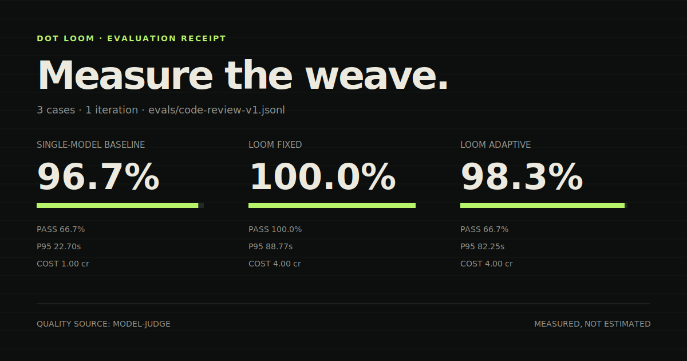
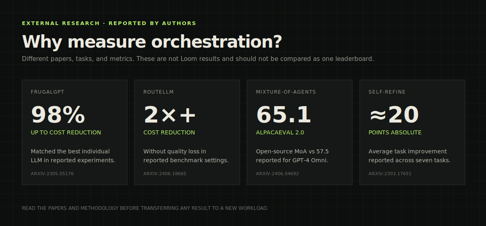

# Dot Loom

[](https://github.com/usedotai/dot-loom/stargazers)

**Stop guessing whether more models help. Measure it.**

Dot Loom is a provider-pluggable orchestration and evaluation runtime for multi-model inference. It compares a strong single-model baseline against fixed and adaptive workflows on the same tasks, then produces an auditable receipt for quality, cost, latency, tokens, and pass rate.

It is not a foundation model. It composes existing models into observable role-based pipelines:

```txt
router -> drafter -> critic/verifier -> finalizer
```

Run the same workflow with Dot, OpenRouter, OpenAI-compatible endpoints, Ollama, LM Studio-compatible local servers, or deterministic mocks.

```bash
npm run eval:mock
```

```txt
Strategy                 Quality    Avg cost/run    Cost index    P95 latency    Pass rate
Single-model baseline    measured   measured        100           measured       measured
Loom fixed               measured   measured        relative      measured       measured
Loom adaptive            measured   measured        relative      measured       measured
```

Loom fills that table from actual runs. It leaves unavailable fields blank rather than inventing benchmark wins.

Dot Loom is the open R&D surface behind the same systems philosophy as Dot Supercharged: do not assume one giant model is always the right inference primitive. Route, draft, verify, synthesize, and measure.

## Status

This repository is an early technical scaffold. It is suitable for experimentation, demos, local provider tests, and architecture review. It is not yet a benchmarked replacement for commercial multi-agent systems.

Current maturity: strong prototype.

What works now:

- Fixed orchestration pipeline.
- Adaptive workflow mode with a small planner.
- Provider abstraction for Dot, OpenAI-compatible APIs, Ollama, and mock runs.
- Streaming CLI traces.
- Per-role token and timing summaries.
- Reproducible baseline vs fixed vs adaptive eval runs.
- Independent, strategy-blinded model judging with task-specific rubrics.
- Parallel eval execution for larger suites.
- Shareable HTML, SVG, Markdown, and JSON benchmark reports.
- A 15-case adversarial backend/code-review benchmark suite.
- Studio UI for visualizing model interaction and live process traces.
- BYOK Studio bridge that can run arbitrary role maps without persisting provider keys.
- Access-list based context gating in adaptive mode.

What is not done yet:

- Human-reviewed benchmark results across multiple providers.
- Learned or evolved routing policies.
- Parallel branch execution.
- Tool-call isolation per worker.
- Long-term trace corpus and regression dashboard.
- Reproducible benchmark claims against Fugu, MoA, or frontier single-model baselines.

## Repository Layout

```txt
dot-loom/
  src/
    cli.mjs                         CLI entrypoint
    config.mjs                      provider/model config parsing
    fusion.mjs                      fixed pipeline runtime
    adaptive.mjs                    adaptive planner/runtime
    eval.mjs                        benchmark runner and scoring
    report.mjs                      shareable HTML/SVG reports
    providers/                      provider adapters
    pipelines/                      pipeline profiles
  examples/
    mock.config.json                offline deterministic demo
    dot.config.json                 Dot API example
    dot-code.config.json            Dot API code-review lane
    openrouter.config.json          OpenRouter compatible example
    ollama.config.json              local Ollama example
  evals/
    code-review-v1.jsonl            adversarial public benchmark suite
  docs/
    BENCHMARKING.md                 publication methodology
    STUDIES.md                      research evidence and boundaries
  studio/
    server.mjs                      local Studio bridge
    src/                            React visualization surface
```

## Installation

Requirements:

- Node.js 20 or newer.
- Optional provider API keys.
- Optional Ollama if running local models.

Install Studio dependencies only if you want the UI:

```bash
cd dot-loom
npm run studio:install
```

The CLI itself has no runtime dependencies.

## CLI Quick Start

Run the deterministic mock pipeline:

```bash
npm run demo
```

Inspect a config:

```bash
npm run doctor
```

List pipeline profiles:

```bash
node src/cli.mjs pipelines
```

Run fixed orchestration:

```bash
node src/cli.mjs run "Review this API design for billing and privacy bugs." \
  --pipeline code-review \
  --config examples/mock.config.json
```

Run adaptive orchestration:

```bash
node src/cli.mjs run "Review this API design for billing and privacy bugs." \
  --adaptive \
  --pipeline code-review \
  --config examples/mock.config.json
```

Run baseline only:

```bash
node src/cli.mjs run "Review this API design for billing and privacy bugs." \
  --baseline \
  --config examples/mock.config.json
```

Emit JSON:

```bash
node src/cli.mjs run "Find edge cases in a credits API." \
  --pipeline code-review \
  --config examples/mock.config.json \
  --json
```

## Reproducible Evaluations

Compare the single-model baseline with fixed and adaptive Loom workflows:

```bash
npm run eval:mock
```

Run the public code-review suite and generate a shareable report:

```bash
node src/cli.mjs eval \
  --dataset evals/code-review-v1.jsonl \
  --config examples/dot-code.config.json \
  --strategies baseline,fixed,adaptive \
  --iterations 3 \
  --concurrency 3 \
  --output reports/code-review-v1.html
```

Each dataset line contains a prompt and deterministic acceptance checks:

```json
{"id":"credits-api","pipeline":"code-review","prompt":"Review this credits API.","checks":[{"type":"contains","value":"privacy"},{"type":"contains-any","values":["billing","credit"]},{"type":"not-contains","value":"sorry"}]}
```

Supported checks are `contains`, `contains-any`, and `not-contains`. Without a model judge, quality is the percentage of checks passed and pass rate is the percentage of runs satisfying every check.

For rubric-based evaluation, use an independent judge model:

```bash
node src/cli.mjs eval \
  --dataset evals/code-review-v1.jsonl \
  --config examples/dot-code.config.json \
  --judge-model dot/your-independent-judge \
  --include-answers \
  --output reports/code-review-v1.json
```

The judge receives the task, rubric, and candidate answer—not the strategy name, models, cost, or latency. Judge usage is recorded separately and excluded from workflow cost. Model judging remains a proxy; publishable studies should include human review.

Cost is calculated from actual token usage only when every invoked model has explicit per-million-token pricing:

```json
{
  "pricing": {
    "provider/model-id": {
      "inputPerMillion": 0.15,
      "outputPerMillion": 0.60
    }
  }
}
```

Pricing is configuration, never a built-in marketing assumption. If any price is missing, Loom reports USD cost as unavailable instead of inventing a number. Every JSON run includes per-model token usage and configured USD cost or native provider-receipt data. When the baseline has a non-zero measured cost, the report also normalizes it to a cost index of `100`.

When a provider returns a native payment receipt, Loom can use that provider unit—such as Dot credits—without pretending it is USD. Judge cost is tracked separately and excluded from workflow cost.

Output format follows the file extension:

```txt
report.html    responsive evidence dashboard
report.svg     shareable benchmark card
report.md      Markdown comparison table
report.json    complete machine-readable receipt
```

Read the [benchmark methodology](docs/BENCHMARKING.md) before publishing performance claims.

## Exploratory Dot smoke benchmark



On 2026-07-14, we ran the first three `code-review-v1` cases once through the Dot model map in `examples/dot-code.config.json`. Gemma judged answers without seeing strategy names or model identities.

| Strategy | Judge quality | Provider cost/run | Cost index | P95 latency | Full pass rate |
|---|---:|---:|---:|---:|---:|
| Single-model baseline | 96.7% | 1.00 credit | 100 | 22.70s | 66.7% |
| Loom fixed | 100.0% | 4.00 credits | 400 | 88.77s | 100.0% |
| Loom adaptive | 98.3% | 4.00 credits | 400 | 82.25s | 66.7% |

The useful finding is not “more models are cheaper.” On this tiny high-risk sample, fixed orchestration improved rubric/check coverage, but required four provider calls and roughly four times the latency and credits. Adaptive selected the same full workflow for these complex cases, so it did not save cost. That is exactly the trade-off Loom is designed to expose.

This is an **exploratory smoke result**, not a general benchmark claim: three synthetic cases, one iteration, one provider, one model judge, no human review, and a 900-token workflow cap. Judge calls averaged one additional credit and are excluded from the workflow-cost column.

- [Raw JSON receipt](docs/benchmarks/dot-code-review-smoke.json)
- [Shareable HTML report](docs/benchmarks/dot-code-review-smoke.html)
- [Markdown report](docs/benchmarks/dot-code-review-smoke.md)
- [Full 15-case suite](evals/code-review-v1.jsonl)
- [Publication methodology](docs/BENCHMARKING.md)

## What published studies suggest



These are results reported by the cited authors on different tasks, models, and metrics. They are **not Dot Loom results and are not directly comparable**.

| Study | Author-reported finding | Why it matters to Loom |
|---|---|---|
| [FrugalGPT](https://arxiv.org/abs/2305.05176) | Up to 98% cost reduction while matching the best individual LLM in reported experiments; or +4% accuracy over GPT-4 at the same cost | Cascades can improve a task-specific cost/quality frontier |
| [RouteLLM](https://arxiv.org/abs/2406.18665) | More than 2× cost reduction in some settings without sacrificing response quality | Learned routing can avoid unnecessary strong-model calls |
| [Mixture-of-Agents](https://arxiv.org/abs/2406.04692) | 65.1 on AlpacaEval 2.0 for the reported open-source MoA configuration vs 57.5 for GPT-4 Omni | Aggregating diverse model outputs can outperform an individual model |
| [Self-Refine](https://arxiv.org/abs/2303.17651) | Roughly 20 percentage points absolute average improvement across seven reported tasks | Feedback and refinement can improve first-pass outputs |

See [Research behind Dot Loom](docs/STUDIES.md) for additional studies, direct links, and interpretation boundaries.

## Studio

Start the local Studio:

```bash
npm run studio
```

Default URL:

```txt
http://localhost:3955
```

The Studio exposes four modes:

- `DEMO`: visual deterministic simulation, no provider call.
- `CLI-MOCK`: real CLI execution with the mock provider.
- `CLI-DOT`: real CLI execution using `DOT_API_KEY`.
- `CLI-BYOK`: real CLI execution using a provider selected in the UI.

The BYOK bridge writes a temporary config to the OS temp directory, executes the CLI, then deletes the config. API keys pasted into the Studio are not written into this repository.

## Provider Model

Model references use this format:

```txt
provider/model-id
```

Minimal provider config:

```json
{
  "providers": {
    "dot": {
      "type": "dot",
      "baseUrl": "https://api.usedot.xyz/agent/v1",
      "apiKey": "env:DOT_API_KEY"
    }
  },
  "models": {
    "router": "dot/dot-nemotron-nano",
    "drafter": "dot/dot-deepseek-v4-flash",
    "critic": "dot/dot-gemma-4-uncensored",
    "finalizer": "dot/dot-qwen-coder-480b"
  }
}
```

OpenAI-compatible provider:

```json
{
  "providers": {
    "gateway": {
      "type": "openai-compatible",
      "baseUrl": "https://provider.example/v1",
      "apiKey": "env:PROVIDER_API_KEY"
    }
  },
  "models": {
    "router": "gateway/small-router-model",
    "drafter": "gateway/cheap-draft-model",
    "critic": "gateway/strong-verifier-model",
    "finalizer": "gateway/best-final-model"
  }
}
```

Local Ollama provider:

```bash
ollama pull gemma3:4b
ollama pull qwen2.5-coder:7b
node src/cli.mjs run "Find edge cases in this architecture." \
  --config examples/ollama.config.json
```

## Execution Modes

### Fixed

Fixed mode is deterministic at the orchestration layer:

```txt
router -> drafter -> critic -> finalizer
```

It is useful for debugging and direct comparisons against a single-model baseline.

### Adaptive

Adaptive mode asks the router for compact routing notes. Loom's current bounded planner then selects a deterministic task profile and worker sequence. Each step receives prior outputs admitted by its access list.

The planner output is intentionally constrained:

```txt
step id
worker id
objective
allowed context ids
expected artifact type
```

This is not a full autonomous agent loop yet. It is a bounded orchestration scaffold that makes model collaboration inspectable.

### Baseline

Baseline mode sends the prompt to the finalizer model only. Use it to compare:

- latency
- token volume
- answer quality
- failure modes
- cost or credit consumption

## Context Gating

Dot Loom treats context as an orchestration input, not a global blob.

In adaptive mode, each worker currently receives:

- the original task
- prior outputs if listed by the planner
- role-specific instructions
- no hidden global memory

Access lists currently gate prior worker outputs, not the original task. This explicit boundary is the foundation for future enforceable task-level context policies.

## Streaming and Observability

The CLI streams role activity by default:

```txt
[router] provider/model
[drafter] provider/model
[critic] provider/model
[finalizer] provider/model
```

For providers that expose token chunks, the CLI prints tokens live. For providers that expose structured events, such as Dot privacy or billing frames, Loom prints those frames in the trace.

The Studio keeps the live process trace fixed at the bottom so users can watch the orchestration without scrolling through the full response.

## Design Lineage

Dot Loom is closest to a practical, hackable orchestration layer. It takes inspiration from several research directions without claiming to reproduce their full results.

Sakana Fugu is the closest product-level reference: a multi-agent orchestration system exposed through standard OpenAI-format APIs, with the orchestration hidden behind a normal model interface.

Mixture-of-Agents reports that multiple LLM agents can outperform an individual model in its evaluated settings by layering candidate responses and passing prior outputs forward.

FrugalGPT reports that cascades and routing can reduce inference cost while preserving or improving quality for selected tasks.

Self-Refine and Reflexion report gains from feedback and critique loops at inference time without weight updates in their evaluated settings.

Tree of Thoughts formalizes deliberate search over intermediate reasoning states rather than a single left-to-right output path.

Speculative decoding is a different layer of the stack, but it motivates the broader principle that a smaller draft model plus a stronger verifier can improve latency. Loom applies that principle at the workflow level, not at token-level decoding.

Sakana's Evolutionary Model Merge and CycleQD work are relevant to future Loom directions: automatically discovering better mixtures, workers, and policies instead of hand-picking role maps.

## References

- Sakana Fugu: https://sakana.ai/fugu-beta/
- Sakana Fugu API docs: https://console.sakana.ai/get-started
- Mixture-of-Agents Enhances Large Language Model Capabilities: https://arxiv.org/abs/2406.04692
- FrugalGPT: How to Use Large Language Models While Reducing Cost and Improving Performance: https://arxiv.org/abs/2305.05176
- Fast Inference from Transformers via Speculative Decoding: https://arxiv.org/abs/2211.17192
- Self-Refine: Iterative Refinement with Self-Feedback: https://arxiv.org/abs/2303.17651
- Reflexion: Language Agents with Verbal Reinforcement Learning: https://arxiv.org/abs/2303.11366
- Tree of Thoughts: Deliberate Problem Solving with Large Language Models: https://arxiv.org/abs/2305.10601
- Evolutionary Optimization of Model Merging Recipes: https://arxiv.org/abs/2403.13187
- CycleQD: Population-based Model Merging via Quality Diversity: https://sakana.ai/cycleqd/
- The AI Scientist: Towards Fully Automated Open-Ended Scientific Discovery: https://arxiv.org/abs/2408.06292

## How Close Is This To Fugu/Sakana?

Dot Loom is not Fugu. Fugu is a hosted orchestration model interface with hidden internal coordination and production infrastructure.

Dot Loom gets close on these primitives:

- Standard CLI and JSON result surface.
- Multiple workers behind one user-facing run.
- Routing before execution.
- Role assignment.
- Context partitioning.
- Verifier/critic pass.
- Provider abstraction.
- Streaming trace and receipts.
- UI that exposes orchestration instead of hiding it.

Dot Loom is still behind on:

- Learned conductor policy.
- Multi-provider, human-reviewed benchmark corpus.
- Automatically evolved worker selection.
- Parallel execution scheduler.
- Built-in tool sandboxing.
- Long-run memory and trace learning.
- Public performance claims.

The honest framing is: Loom is an open, inspectable scaffold for Fugu-style orchestration experiments. It is not a solved orchestration model.

## Security Notes

- Do not commit API keys.
- Use `env:NAME` references in config files.
- The Studio BYOK mode creates temporary config files outside the repository and deletes them when the run exits.
- `.env` and `.env.*` are ignored.
- `node_modules` and build artifacts are ignored.
- The mock provider is recommended for screenshots, CI, and public demos.

If a real API key was ever pasted in terminal history or a chat transcript, rotate it before publishing a public repository.

## Verification

Run the automated tests:

```bash
npm run test
```

Run the CLI smoke test and deterministic eval example:

```bash
npm run test:smoke
npm run eval:mock
```

Build the Studio:

```bash
npm run studio:install
npm run studio:build
```

Run both:

```bash
npm run verify
```

## Contributing benchmarks

Provider adapters, pipeline profiles, datasets, and reproducible model recipes are welcome. Benchmark submissions must include raw receipts, exact model identifiers, run settings, limitations, and cases where Loom lost. Screenshots alone are not accepted as evidence.

See [CONTRIBUTING.md](CONTRIBUTING.md) or open the benchmark-submission issue template.

## Roadmap

Near term:

- Add human review and judge-agreement reporting.
- Publish multi-provider `code-review-v1` results with raw receipts.
- Persist anonymized local traces for regression tests.
- Add LM Studio examples.
- Add tool-call isolation and explicit tool permissions.
- Add parallel worker branches.

Medium term:

- Learn routing policies from trace outcomes.
- Add model-pair calibration for drafter/verifier compatibility.
- Add cost-aware planner objectives.
- Add historical benchmark regression dashboards.
- Add local-only privacy mode for sensitive runs.

Long term:

- Evolve role maps automatically.
- Evolve prompt policies automatically.
- Train a conductor model for task decomposition.
- Support hybrid local plus hosted execution.
- Publish reproducible benchmarks for orchestration strategies.


<a href="https://www.star-history.com/?repos=usedotai%2Fdot-loom&type=timeline&legend=bottom-right">
 <picture>
   <source media="(prefers-color-scheme: dark)" srcset="https://api.star-history.com/chart?repos=usedotai/dot-loom&type=timeline&theme=dark&logscale&legend=bottom-right" />
   <source media="(prefers-color-scheme: light)" srcset="https://api.star-history.com/chart?repos=usedotai/dot-loom&type=timeline&logscale&legend=bottom-right" />
   
 </picture>
</a>
