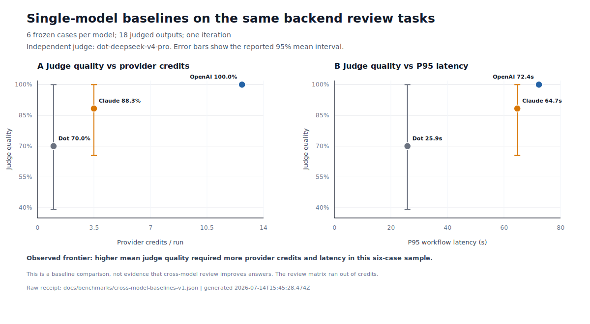
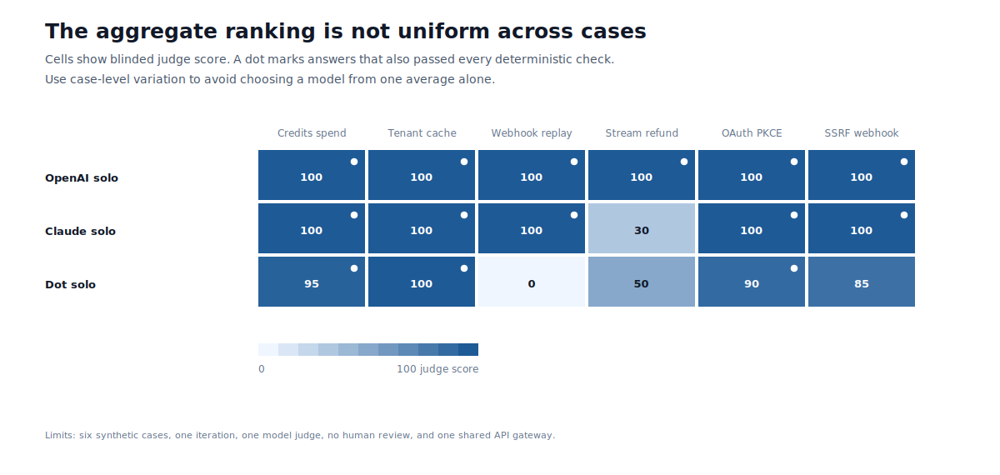

# Cross-model baseline study

Run date: 2026-07-14

## Research question

Before measuring cross-model review, what quality, native-credit, and latency frontier do the configured OpenAI, Claude, and Dot single-model baselines establish on the same backend-review tasks?

## Design

- Six frozen high-risk cases from `evals/code-review-v1.jsonl`.
- One iteration per model and 18 candidate answers total.
- Temperature `0.1` and a 900-token candidate limit.
- OpenAI GPT-5.5, Claude Sonnet 5, and Dot Qwen Coder 480B accessed through the same Dot API gateway.
- DeepSeek V4 Pro used as the independent strategy-blinded judge.
- Candidate answers had to pass the model judge and every deterministic check for a full pass.
- Workflow credits exclude judge calls. Judge calls used 20 additional credits.

## Aggregate results

| Model | Mean judge quality | 95% interval | Full pass rate | Mean workflow credits | P95 workflow latency |
|---|---:|---:|---:|---:|---:|
| OpenAI GPT-5.5 | 100.0% | 100.0% to 100.0% | 100.0% | 12.67 | 72.37s |
| Claude Sonnet 5 | 88.3% | 65.5% to 100.0% | 83.3% | 3.50 | 64.73s |
| Dot Qwen Coder 480B | 70.0% | 39.1% to 100.0% | 50.0% | 1.00 | 25.86s |



## Case-level judge scores

| Case | OpenAI | Claude | Dot |
|---|---:|---:|---:|
| Idempotent credit spend | 100 | 100 | 95 |
| Tenant cache leak | 100 | 100 | 100 |
| Webhook replay | 100 | 100 | 0 |
| Streaming refund semantics | 100 | 30 | 50 |
| OAuth state and PKCE | 100 | 100 | 90 |
| SSRF webhook destination | 100 | 100 | 85 |



## Technical findings

1. Provider calls were not interchangeable cost units. Mean native cost ranged from 1.00 to 12.67 credits per answer.
2. The observed ordering was monotonic in this sample: higher mean quality also used more credits and had higher P95 latency.
3. Aggregate means hid concentrated failures. Claude's lower mean came from one 30-point streaming-billing answer. Dot's lower mean included one zero-point webhook answer.
4. The cost observation motivated `adaptive.estimatedCreditsByModel`, which lets Loom price the next planned worker before starting it.

## Incomplete cross-review matrix

The planned matrix also included:

- OpenAI writer with Claude reviewer.
- Claude writer with OpenAI reviewer.
- Dot writer with Claude reviewer and OpenAI finalizer.

The provider returned HTTP 402 during the first reviewer lane. Those incomplete results are not included or inferred. The runner checkpoints completed lanes and can resume after credits are replenished:

```bash
npm run benchmark:cross-model
```

When all six lanes complete, generate the quality-credit frontier, paired case deltas, and six-lane heatmap:

```bash
npm run figures:cross-model:complete
```

## Interpretation boundary

This is an exploratory baseline study. Six synthetic cases, one iteration, one model judge, no human review, and a shared gateway are not sufficient for a general model ranking. The result establishes a reproducible local baseline and a cost-accounting finding. It does not yet establish that cross-model review improves quality.

- [Raw receipt with all candidate answers and judge reasons](cross-model-baselines-v1.json)
- [Summary CSV](../figures/cross-model-baselines.csv)
- [Benchmark methodology](../BENCHMARKING.md)
