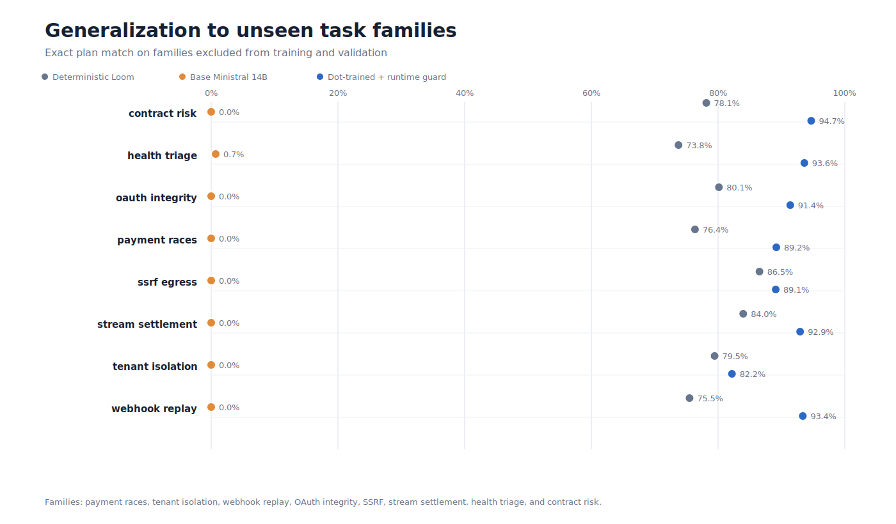
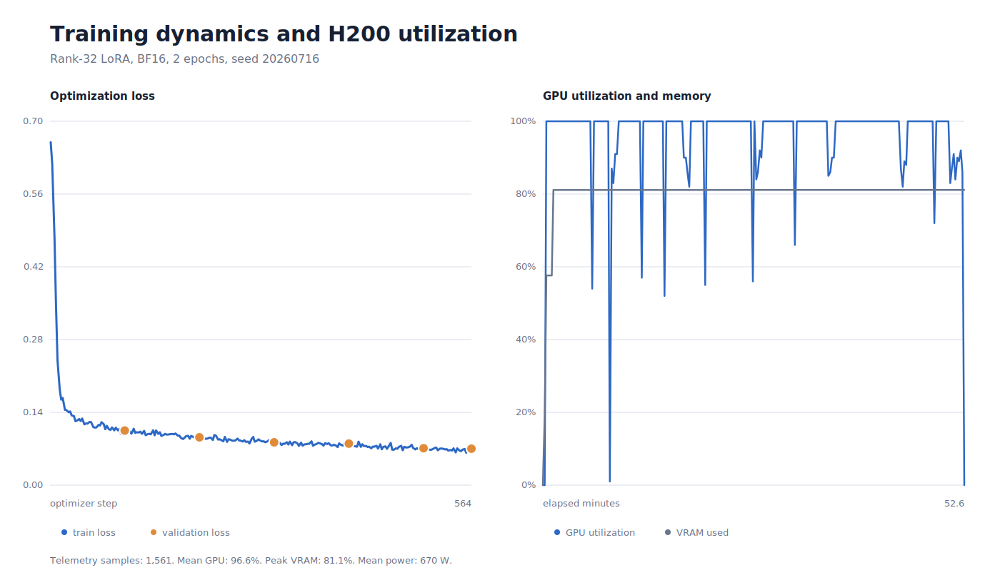
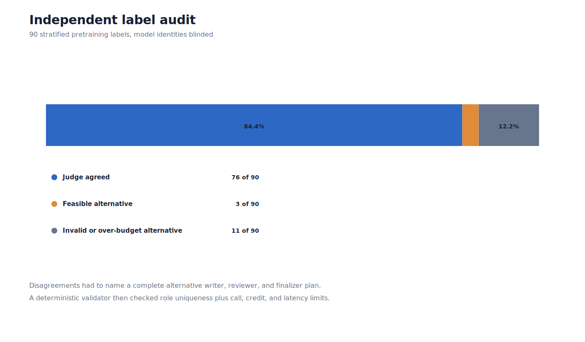

# Dot Loom Ministral 14B Conductor Benchmark

We trained a local 14B Mistral model to decide when one AI model is enough and when a task needs independent verification.


## Held-out results

The test set contains 1,200 synthetic cases from eight task families that never appear in training or validation.

| Lane | JSON valid | Receipt consistent | Policy accuracy | Exact plan | Constraints met | Fallback | Unsafe under-escalation | Mean regret | P95 batch latency |
|---|---:|---:|---:|---:|---:|---:|---:|---:|---:|
| Deterministic Loom | 100.0% | 100.0% | 93.9% | 79.3% | 100.0% | 0.0% | 5.7% | 1.733 | n/a ms |
| Base Ministral 14B | 1.0% | 0.1% | 0.4% | 0.1% | 0.1% | 0.0% | 98.1% | 1051.175 | 20900.5 ms |
| Dot-trained raw proposals | 100.0% | 99.2% | 99.7% | 90.2% | 98.9% | 0.0% | 0.0% | 11.823 | 21879.0 ms |
| Dot-trained + runtime guard | 100.0% | 99.2% | 100.0% | 90.8% | 100.0% | 1.1% | 0.0% | 0.245 | 21879.0 ms |

The raw conductor exceeded a hard budget on 13 of 1,200 proposals. The local guard caught all of them and invoked the deterministic fallback on 13 cases (1.1%).

Declared quality and pass-rate estimates are evaluated as calibration errors, not as hard receipt fields.

| Lane | Quality estimate MAE | Quality estimate P95 error | Pass-rate estimate MAE |
|---|---:|---:|---:|
| Deterministic Loom | 0.0000 | 0.0000 | 0.0000 |
| Base Ministral 14B | 0.1326 | 0.1326 | 0.1913 |
| Dot-trained raw proposals | 0.0056 | 0.0179 | 0.0089 |
| Dot-trained + runtime guard | 0.0055 | 0.0178 | 0.0087 |

## Paired statistical comparison

- Exact-plan improvement over deterministic Loom: 11.5%, paired bootstrap 95% CI 9.4% to 13.7%.
- Mean utility-regret reduction: 1.488 (85.9%), paired bootstrap 95% CI 1.256 to 1.735.
- Quality-target attainment improvement: 8.8%, paired bootstrap 95% CI 7.2% to 10.5%.
- Unsafe under-escalation reduction: 5.7%, paired bootstrap 95% CI 4.4% to 7.0%.
- Exact-plan McNemar two-sided p-value: < 1e-12.



## Training receipt

- Base revision: `5b0ceedbb42dff466ae60b258ba296f32da51384`
- Training examples: 9,000
- Validation examples: 900
- Trainable parameters: 139,984,896 of 14,085,016,576
- Validation-selected checkpoint: `checkpoint-564` at loss 0.070168
- Adapter weights: 534.1 MiB, SHA-256 `e0e6655a16a10f28cbce898e564640bf6a4a64ca84bb2014a1da3a60c5f11eda`
- Duration: 52.6 minutes
- Peak allocated VRAM: 69.5 GiB
- Mean GPU utilization: 96.6%
- Integrated GPU energy: 0.588 kWh
- Final validation loss: 0.070168
- Train data SHA-256: `8e8244bb5ad7034f6d2a5949503526762895072875998662510d5a3a9b269739`



## Label audit

A blinded independent OpenAI judge agreed with 76 of 90 pretraining labels. It proposed 14 alternatives. Deterministic validation found 3 feasible and 11 invalid or over-budget.
None of the feasible alternatives improved the disclosed oracle utility (0 of 3).



## Reproduce

```bash
cd /home/sesterce/dot-loom-conductor
scripts/run_full_benchmark.sh
demo/03_show_benchmark.sh
demo/05_verify_artifacts.sh
```

## Scope

This study measures constrained routing-plan generation, not end-to-end code quality. Labels come from a disclosed simulator calibrated to a six-case Dot Loom receipt. See [`docs/METHODS.md`](../docs/METHODS.md) for assumptions and limitations.
